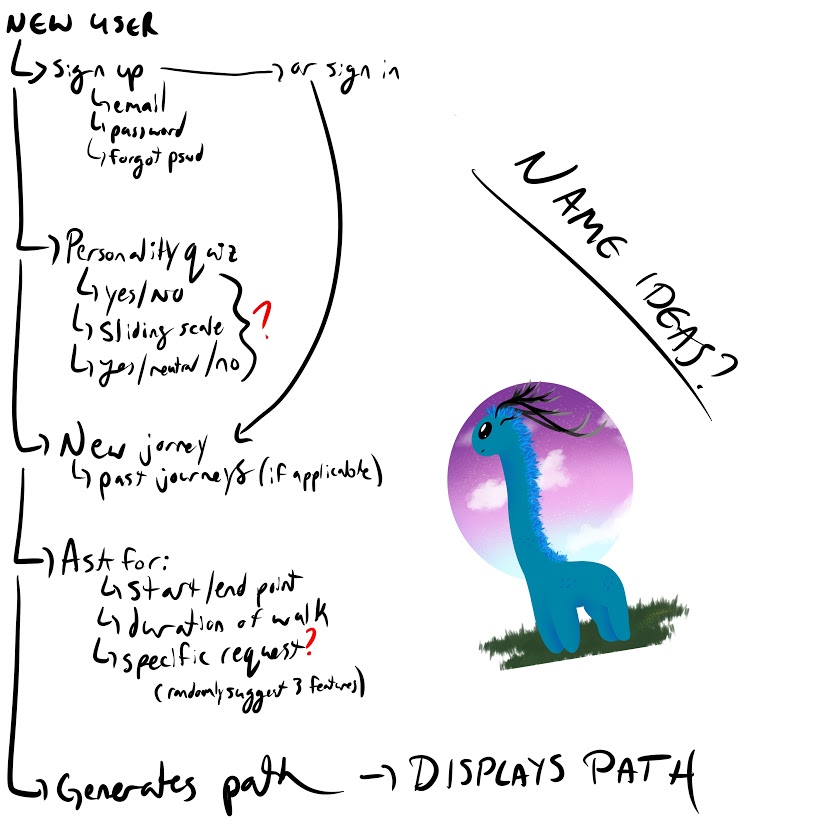
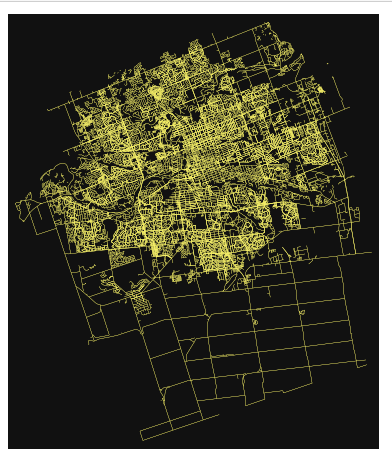
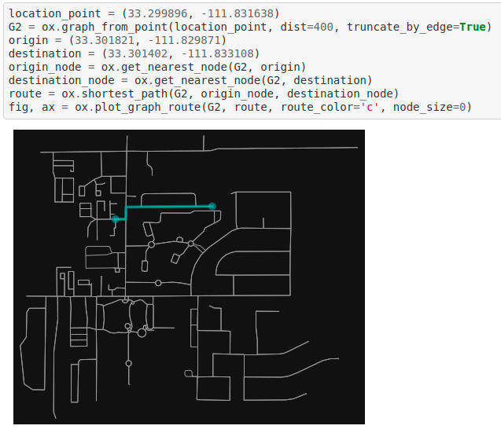

# Making the mundane interesting!

During the COVID-19 pandemic and the need to stay away from our fellow friends for the safety of our community, going outdoors has been one of the priorities to avoid cabin fever. However, as this quarantine stretches longer into the future, a few of us are getting bored of seeing the same parks and the same trees each time. What if there was a way to discover new parts of our city of London without aimlessly walking around - perhaps getting lost?

## Why a walking app?

We love our pets; and our app shows that there may be a bias for our furry friends. We wanted to make an app that fellow furry friend lovers could use during this period. Sometimes, when going on walks, we often see the same corner, the same tree, the same park, so on and so forth. We'd imagine that our furry friends may get bored too, and may want to see a new fire hydrant, new tree to pee on, or something new to just smell and do dog things with. 

## How it works

Our app takes in JSON data from [OpenData](https://opendata.london.ca), from the city of London, and aggregates them into a map showing these features as points of interest. 

Answering a quick personality test of the kind of walker you would be, such as 
* Do you have pets?
* Do you like water?

Would then recommend routes based on how you answered. Those with pets would be recommended routes that bias towards fire hydrants, trees, parks, and green spaces. Those who wanted water would have a larger bias towards landmarks with bias to water features like water bodies or water streams. 

## Our Frontend

We used figma to create the user experience. The general user experience has been sketched out below in a fun visual.

What was created was a mockup of a frontend that is meant to be used on a mobile device to have a seamless experience in our connected world. 

## Our Backend

Google Cloud has provided hosting services for a Postgres SQL server which holds all of the data from OpenData but is able to be served to a scaleable amount of users without putting strain onto OpenData or the servers of the City of London.

Current implementation of the backend is a data visualization of some of the points in a given circumference of a starting point. The user can create paths based on points of interest in that area.

A machine learning aspect is to classify users based on how they would answer the personality questions. Attached are the [Profiles](https://docs.google.com/spreadsheets/d/1JJ9xPv4ixepKdF407_7O7y5pQClbC7J9XcJ-kNOg66k/edit#gid=0) we would expect a user would fall into.

Based on how the user answers, a trained Logistic Regression Classifier using cross-entropy loss for multiple classes would predict which class the user falls into, and then provide a recommender bias towards one of the preset personalities. 

## Trials and Tribulations

About 5 hours of effort was given to try using DataStax as the database as a service. Much of that time was spent trying to upload JSON data into the GCP back-end using dsbulk. Needless to say, it was terribly difficult even for a professional who uses SQL in their professional life. We learned that there was a bigger difference between NoSQL and SQL than previously thoughts. 

Some of us came into this hackathon with no front end programming experience, and rapidly learned about some new tools to develop attractive and easy front end user interactions. We learned about figma, a front end clickable pro-typing app designer 
which requires no coding experience. 

In exploring ways to plot paths, we discovered [OSMNX](https://github.com/gboeing/osmnx), a python API to retrieve, model, analyze, and visualize OpenStreetMap street networks and other spatial data. 

We have been able to use OSMNX to display data such as the street network:

We have been able to do preliminary point to point path-finding on the app.

## Next Steps

Currently, it would be to:

* Integrate the Database as a Service from Google Cloud to our application
* Add more than one way-point to our current path-finding system
* Move deployment of the application from a proof of concept Jupyter Notebook to something more user interactive, such as Streamlit, Flask, or another quick front end experience
* Implement a simple Logistic Regression to classify users based on how they answered questions to better recommend 
